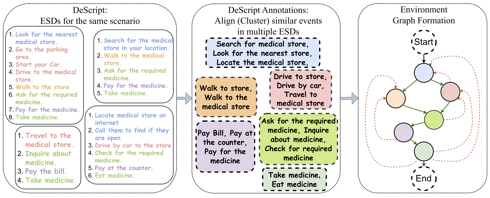
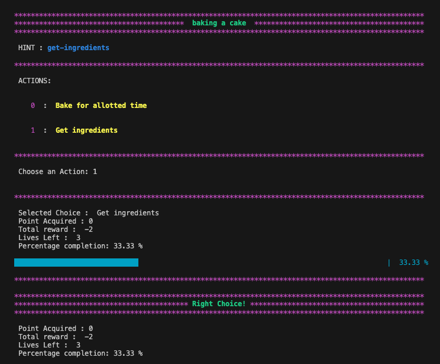

# ScriptWorld: Text Based Environment For Learning Procedural Knowledge


**Picture:** *The figure shows a simplified version of the  scenario, "Get Medicine", and the process of creating an environment graph (right diag.) from the ESDs (left diag.) and aligned events (middle diag.) for the scenario. The green directed edges in the environment graph represent the correct paths, and the red edges denote the environment transition when a wrong option is selected.*


## Table of Contents
- [Introduction](#introduction)
- [Requirements](#requirements)
- [Running Terminal version of ScriptWorld](#running-terminal-version-of-scriptworld)
- [Running Gym version of ScriptWorld](#running-gym-version-of-scriptworld)
- [Compact Graphs](#compact-graphs)
- [License](#license)
- [Citation](#citation)


## Introduction
This repository contains the official release of the following paper:
> **ScriptWorld: Text Based Environment For Learning Procedural Knowledge**<br>

> **Authors:** Abhinav Joshi, Areeb Ahmad, Umang Pandey, and Ashutosh Modi <br>
>
> **Abstract:** *Text-based games provide a framework for developing natural language understanding and commonsense knowledge about the world in reinforcement learning based agents. Existing text-based environments often rely on fictional situations and characters to create a gaming framework and are far from real-world scenarios. In this paper, we introduce **ScriptWorld**: a text-based environment for teaching agents about real-world daily chores and hence imparting commonsense knowledge. To the best of our knowledge, it is the first interactive text-based gaming framework that consists of daily real-world human activities designed using scripts dataset. We provide gaming environments for 10 daily activities and perform a detailed analysis of the proposed environment. We develop RL-based baseline models/agents to play the games in **ScriptWorld**. To understand the role of language models in such environments, we leverage features obtained from pre-trained language models in the RL agents. Our experiments show that prior knowledge obtained from a pre-trained language model helps to solve real-world text-based gaming environments.*

## Requirements

- We use [Gym](https://github.com/openai/gym) for creating the environment for ScriptWorld and [Stable-Baselines3](https://github.com/DLR-RM/stable-baselines3) for training the RL agents. All the experiment results reported in the paper are obtained using Stable-Baselines3.

- For creating the environment graph, we use [NetworkX](https://networkx.org/).

- For textual features we use [SBERT](https://www.sbert.net/).


## Running Terminal version of ScriptWorld

The terminal version of ScriptWorld can be run using the following command:

    Script_World/envs/$ python Script_World_terminal.py --scn 'baking a cake' --no_of_actions 2 --allowed_wrong_actions=5 --hop 1 --disclose_state_node True --seed 42 --history


<!-- table -->
| Argument | Description |
| --- | --- |
| `scn` | Selects task/scenario (among the available 10 scenarios) |
| `no_of_actions` | Number of action/choices at every step |
| `allowed_wrong_actions` | Maximum no of subsequent wrong actions choices taken after which environment/game will be terminated |
| `hop` | Relative Backward distance of transitioned state (when wrong action/choise is selected) |
| `disclose_state_node` | Flag for disclosing state node (True/False) [handicap/ no-handicap version]|
| `history` | Enables state action history for the current gameplay (shows the list of actions till current time step). [Only applicable in manual gameplay for debuging via terminal, *NOT* applicable for gym environment] |




More gameplay screenshots can be found in the [gameplay_screenshots](./gameplay_screenshots/) directory.

## Running Gym version of ScriptWorld

Register the environment using the following command:

```bash
$ pip install -e .    
```

After the registration, the environment can be can be run using the following code snippet:


```python
import Script_World
import numpy as np
import gym


#make environment
env = gym.make(id='Script-World-v1')
no_of_episodes = 1
for e in range(no_of_episodes):
   env.reset()
   while(not env.done):
        action = np.random.randint(env.action_space.n)
        state, reward, done, info = env.step(action)

```

## Compact Graphs
We also provide compact graphs for the 10 scenarios in the [compact_graphs](./compact_graphs/) directory. The compact graphs can be used as reference for debugging and understanding the scenarios in the ScriptWorld environment.


## License
[](https://creativecommons.org/licenses/by-nc/4.0/)
The ScriptWorld Environment follows [CC-BY-NC](CC-BY-NC) license. Thus, users can share and adapt our dataset/environment if they give credit to us and do not use our dataset/environment for any commercial purposes.


<!-- ## Controbuting to ScriptWorld -->

## Citation

Please cite our paper if you use ScriptWorld in your work:

**ScriptWorld: Text Based Environment For Learning Procedural Knowledge**, Proceedings of the Thirty-Second International Joint Conference on Artificial Intelligence, [IJCAI 2023](https://ijcai-23.org), August 19-25, 2023, Macao, SAR. (Main Track)


    @inproceedings{ijcai2023-scriptworld,
    title     = {ScriptWorld: Text Based Environment For Learning Procedural Knowledge},
    author = {Joshi, Abhinav and Ahmad, Areeb and Pandey, Umang and Modi, Ashutosh},
    booktitle = {Proceedings of the Thirty-Second International Joint Conference on
                Artificial Intelligence, {IJCAI-23}},
    publisher = {International Joint Conferences on Artificial Intelligence Organization},
    year      = {2023},
    month     = {8},
    note      = {Main Track},
    }


[**From Scripts to RL Environments: Towards Imparting Commonsense Knowledge to RL Agents**](https://dl.acm.org/doi/10.5555/3545946.3599083), Proceedings of the 22nd International Conference on Autonomous Agents and MultiAgent Systems, [AAMAS 2023](https://aamas2023.soton.ac.uk), May 2-6, 2023, London, United Kingdom. (Extended Abstract)

    @inproceedings{10.5555/3545946.3599083,
    author = {Joshi, Abhinav and Ahmad, Areeb and Pandey, Umang and Modi, Ashutosh},
    title = {From Scripts to RL Environments: Towards Imparting Commonsense Knowledge to RL Agents},
    year = {2023},
    isbn = {9781450394321},
    publisher = {International Foundation for Autonomous Agents and Multiagent Systems},
    address = {Richland, SC},
    abstract = {Text-based games provide a framework for developing natural language understanding and commonsense knowledge about the world in Reinforcement Learning (RL) based agents. Existing text-based environments often rely on fictional situations and characters to create a gaming framework and are far from real-world scenarios. In this paper, we introduce ScriptWorld: A text-based environment for teaching agents about real-world daily chores and hence imparting commonsense knowledge. To the best of our knowledge, it is the first interactive text-based gaming framework that consists of daily real-world human activities created using scripts dataset. We release the gaming environment and perform a detailed analysis of the proposed environment: https://github.com/Exploration-Lab/ScriptWorld},
    booktitle = {Proceedings of the 2023 International Conference on Autonomous Agents and Multiagent Systems},
    pages = {2801–2803},
    numpages = {3},
    keywords = {commonsense knowledge, nlp, rl, text based games},
    location = {London, United Kingdom},
    series = {AAMAS '23}
    }


[**ScriptWorld: A Scripts-based RL Environment**](https://openreview.net/forum?id=yMHzGXgcQeg), Language and Reinforcement Learning NeurIPS 2022 in-person Workshop, LaReL 2022, December 2nd, New Orleans [[**Best Paper Award 🥈**](https://larel-workshop.github.io/papers/)]

    @inproceedings{
    joshi2022scriptworld,
    title={ScriptWorld: A Scripts-based {RL} Environment},
    author={Abhinav Joshi and areeb ahmad and Umang Pandey and Ashutosh Modi},
    booktitle={Second Workshop on Language and Reinforcement Learning},
    year={2022},
    url={https://openreview.net/forum?id=yMHzGXgcQeg}
    }